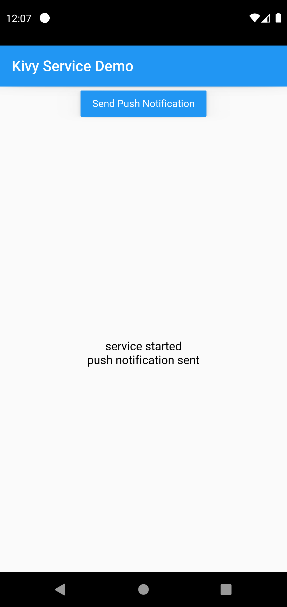
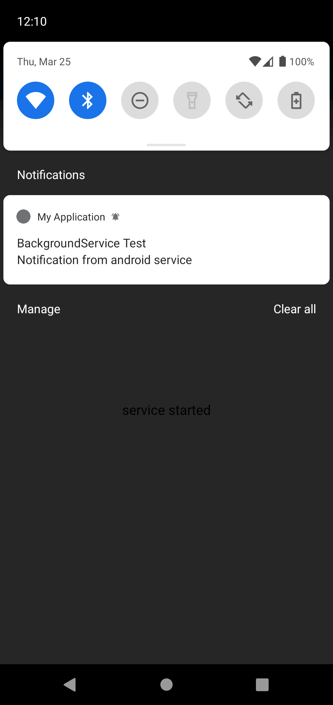

# Kivy android service and push notification example

Demo App which shows how to use push notifications and android services in your KivyMD App.


Screenshot 1            |  Screenshot 2
:-------------------------:|:-------------------------:
  |  


# run desktop version
```
pip install kivymd plyer
python main.py
```

# build android app (with docker)
**Option 1 using Docker (recommended):**
```
docker run --volume "$HOME/.buildozer":/home/user/.buildozer --volume "$PWD":/home/user/hostcwd kivy/buildozer android debug
```
The Android .apk is now inside the bin/ folder

**Option 2 building local (Ubuntu):**
```
sudo apt update

sudo apt install \
    autoconf \
    automake \
    build-essential \
    ccache \
    cmake \
    gettext \
    git \
    libffi-dev \
    libltdl-dev \
    libssl-dev \
    libtool \
    openjdk-13-jdk \
    patch \
    pkg-config \
    python3-pip \
    python3-setuptools \
    sudo \
    unzip \
    zip \
    zlib1g-dev
    
pip install --upgrade Cython==0.29.19 wheel pip virtualenv
pip install buildozer

buildozer android debug
```
